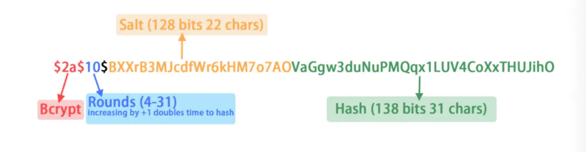

# 用户管理

+ 创建用户
+ 删除用户
+ 更新用户
+ 用户列表
+ 用户详情
+ 重置密码

## 详情设计

```go
// 定义User包的能力 就是接口定义
// 站在使用放的角度来定义的   userSvc.Create(ctx, req), userSvc.DeleteUser(id)
// 接口定义好了，不要试图 随意修改接口， 要保证接口的兼容性
type Service interface {
	// 创建用户
	CreateUser(context.Context, *CreateUserRequest) (*User, error)
	// 删除用户
	DeleteUser(context.Context, *DeleteUserRequest) (*User, error)
	// 查询用户详情
	DescribeUser(context.Context, *DescribeUserRequest) (*User, error)
	// 查询用户列表
	QueryUser(context.Context, *QueryUserRequest) (*types.Set[*User], error)
}
```

### 业务功能

加解迷的方式有分类:
1. Hash (消息摘要): 单向Hash, 可以通过原文 获取摘要信息，但是无法通过摘要信息推断原文, 只要摘要信息相同，原文就相同: md5, sha*, bcrypt ...
2. 对称加解密: 加密和解密的秘密(key)  用于数据的加解密文
3. 非对称加解密:  加密(公钥)和解密(私用)不是用的同一个秘密, 用于密码的加解密

1. 用户密码怎么存储的问题, 存储用户密码的hash，避免直接存储用户密码。 11111 -> abcd, 可能导致 用户的秘密在其他平台泄露 知道了这个影视关系abcd --> 1111,
   能不能有什么办法解决这个问题, 加盐:   相同密码 --> 每次hash会产生不同的结果




password --> hash
password + 随机字符串(salt) -->  (salt)hash它也是随机

输入: password + 随机字符串(salt: 原来hash中的sal部分) == hash它也是随机(数据库)


