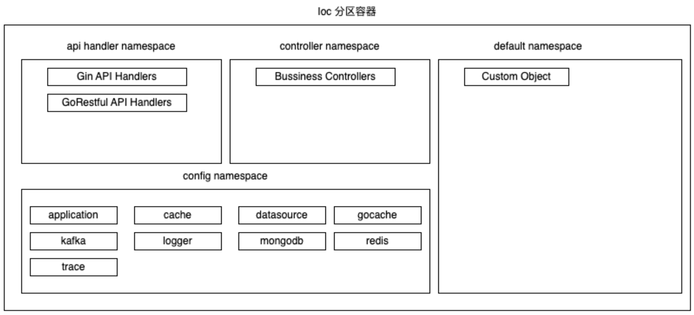

# ioc



# 简易版本Ioc

```go
// ioc 容器功能定义
type Contaienr interface {
	Registry(name string, obj Object)
	Get(name string) Object
	// 初始化所有已经注册的对象
	Init() error
}

// 注册对象的约束
type Object interface {
	Init() error
}
```


```go
// ioc 容器
type MapContainer struct {
	name    string
	storage map[string]Object
}

func (m *MapContainer) Registry(name string, obj Object) {
	m.storage[name] = obj
}

func (m *MapContainer) Get(name string) Object {
	return m.storage[name]
}

// 初始化所有已经注册的对象
func (m *MapContainer) Init() error {
	for _, v := range m.storage {
		if err := v.Init(); err != nil {
			return err
		}
	}

	return nil
}
```